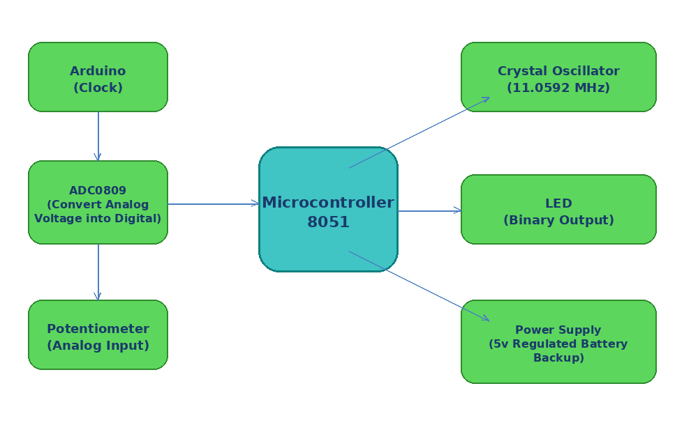
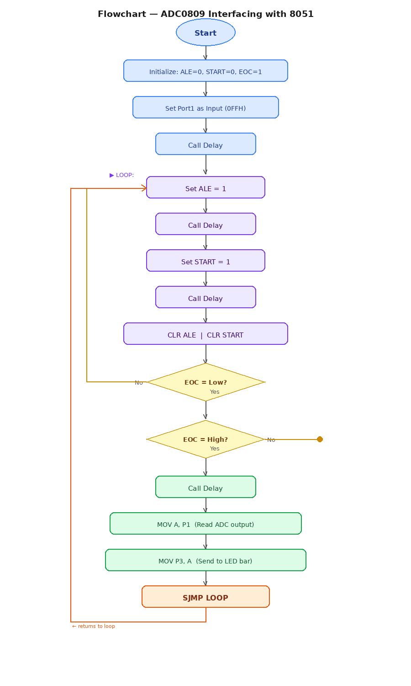
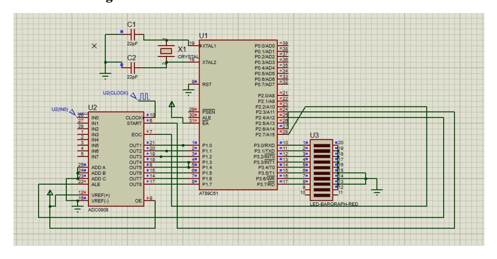

# 💡 ADC Interfacing on LED using 8051

> Interfacing an external **ADC0809** with the **8051 microcontroller** to convert analog voltage into digital output displayed on an **LED bar graph**.  
> Simulated on **Proteus** and programmed in **8051 Assembly** using Keil µVision.

---

## 📌 Project Overview

The 8051 microcontroller lacks a built-in ADC, so this project uses the **ADC0809** IC to convert analog signals (from a potentiometer) into 8-bit digital values. The digital output is then displayed bit-wise on an LED bar graph connected to Port 3.

---

## 🧠 Features

- ✅ Analog-to-digital conversion using **ADC0809**
- ✅ **8-bit binary output** displayed on LED bar graph
- ✅ Clock provided via **Arduino** (640 kHz to ADC)
- ✅ **Crystal oscillator** at 11.0592 MHz for 8051
- ✅ Circuit simulated on **Proteus Software**
- ✅ Programmed in **8051 Assembly** (Keil µVision)

---

## 🗂️ Repository Structure

```
ADC_interfacing/
├── test.a51              # ⭐ 8051 Assembly source code
├── test.uvproj           # Keil µVision project file
├── test.uvopt            # Keil build options
├── test.m51              # Keil map/symbol file
├── block_diagram.png     # System block diagram
├── flowchart.png         # Algorithm flowchart
├── Circuit_diagram.png   # Proteus circuit diagram
└── README.md
```

---

## 🔷 Block Diagram



---

## ⚙️ How It Works

1. Potentiometer provides analog voltage as input to **ADC0809**
2. 8051 sends **ALE** and **START** signals to begin conversion
3. ADC0809 converts analog signal using successive approximation → 8-bit output
4. 8051 polls **EOC** (End of Conversion) pin to detect when data is ready
5. 8051 reads 8-bit data from **Port 1** and outputs to **Port 3**
6. **LED bar graph** lights up showing the binary value

### Port Assignments

| Pin | Port | Function |
|---|---|---|
| `P2.4` | ALE | Address Latch Enable |
| `P2.6` | START | Start ADC conversion |
| `P2.7` | EOC | End of Conversion (input) |
| `P1` | Input | Read 8-bit ADC output |
| `P3` | Output | Drive LED bar graph |

### ADC Output Calculation

For Vref = 5V, Analog input = 4.5V:

```
Bit weights:  Vref/2 + Vref/4 + Vref/8 + Vref/64 + Vref/128
            = 2.5 + 1.25 + 0.625 + 0.078 + 0.039 ≈ 4.5V
Binary out:   1  1  1  0  0  1  1  0
```

---

## 💻 Source Code

```asm
ORG 00H
ALE   EQU P2.4    ; Address Latch Enable
START EQU P2.6    ; Start conversion
EOC   EQU P2.7    ; End of Conversion

      MOV P1,#0FFH  ; Set Port 1 as input
      SETB EOC
      CLR ALE
      CLR START
      ACALL DELAY

LOOP: SETB ALE
      ACALL DELAY
      SETB START
      ACALL DELAY
      CLR ALE       ; High-to-low transition latches address
      CLR START     ; High-to-low triggers conversion start

HERE: JB  EOC,HERE  ; Wait for EOC to go LOW
NOW:  JNB EOC,NOW   ; Wait for EOC to go HIGH (conversion done)
      ACALL DELAY
      MOV A,P1      ; Read ADC output from Port 1
      MOV P3,A      ; Send to LED bar graph on Port 3
      SJMP LOOP

DELAY: MOV  R5,#0FFH
HERE2: MOV  R6,#0FFH
HERE1: DJNZ R6,HERE1
       DJNZ R5,HERE2
       RET
END
```

---

## 🔁 Flowchart



---

## 🔌 Circuit Diagram



---

## 🚀 Getting Started

### Prerequisites
- [Keil µVision](https://www.keil.com/download/product/) — for assembling 8051 code
- [Proteus Design Suite](https://www.labcenter.com/) — for circuit simulation

### Steps
1. Open `test.uvproj` in Keil µVision
2. Build the project (**F7**) to generate `.hex` file
3. Open Proteus and load the `.hex` file into the AT89C51 component
4. Run simulation and adjust the potentiometer to observe LED output change

---

## 📊 Results

- LED bar graph correctly displays 8-bit binary equivalent of analog input
- Changing the potentiometer updates the LED output accordingly
- ADC0809 achieves accurate conversion via successive approximation

---

## ⚠️ Known Limitations

- 8-bit resolution → 256 steps (≈ 19.5 mV per step at 5V)
- External Arduino required to provide 640 kHz clock to ADC0809
- Polling-based EOC detection (no interrupt support)

---

## 🔮 Future Improvements

- [ ] Replace Arduino clock with 8051 Timer-based clock
- [ ] Add LCD to display decimal voltage value
- [ ] Use interrupt-driven EOC instead of polling
- [ ] Read multiple ADC channels (IN0–IN7)

---

## 📚 References

- ADC0809 Datasheet — National Semiconductor
- *The 8051 Microcontroller* — Muhammad Ali Mazidi

---

## 👥 Authors

**Kunj Savani**  
B.Tech Electronics & Communication Engineering  
Nirma University, Institute of Technology

---

## 📄 License

Submitted as an academic assignment. Please do not copy or redistribute without permission.
